# ShopLens — E-Ticaret Davranış Analizi ve Akıllı Ürün Öneri Sistemi

**Hazırlayan:** Özge Güneş  
**Ders / Proje:** İSMEK Yapay Zekâ ve Veri Bilimi  
**Konu:** E-ticaret davranış analizi, ürün öneri skoru, duygu analizi, müşteri segmentasyonu ve kişiye özel ürün öneri sıralaması

## Projenin Amacı

Bu projede bir e-ticaret platformunda müşterilerin ürünlerle olan etkileşimlerini analiz ettim. Amacım yalnızca en çok satan ürünleri listelemek değildi. Ürün görüntüleme, sepete ekleme, sipariş, ürün bilgisi, müşteri bilgisi ve yorum verilerini bir araya getirerek belirli bir müşteri için ürünleri öneri önceliğine göre sıralayan bir sistem kurdum.

Dashboard tarafında hem genel ürün performansını hem de seçilen müşteri için kişisel ürün önerilerini tek ekranda takip edilebilir hale getirdim.

## Veri Seti Kaynağı

Projede Kaggle üzerindeki **E-commerce Transactions + Clickstream** veri setini kullandım.

Kaynak: https://www.kaggle.com/datasets/wafaaelhusseini/e-commerce-transactions-clickstream

Veri seti sentetik olarak üretilmiştir. Buna rağmen müşteri, ürün, oturum, clickstream eventleri, sipariş, sipariş kalemi ve yorum tablolarını birlikte içerdiği için e-ticaret analitiği projesi için uygundur.

## Klasör Yapısı

```text
data/                         Ham veri dosyaları
outputs/                      Analiz çıktıları, skor tabloları ve model metrikleri
outputs/charts/               Dashboard ve sunumda kullanılan grafikler
models/                       Eğitilmiş model dosyaları
pipeline.py                    Veri hazırlama, analiz ve modelleme pipeline'ı
dashboard.py                  Streamlit dashboard
ShopLens_Sunum_Final.pptx     Final proje sunumu
requirements.txt              Gerekli Python kütüphaneleri
```

## Çalıştırma

Gerekli kütüphaneleri yüklemek için:

```bash
pip install -r requirements.txt
```

Analizleri, skor tablolarını, grafikleri ve model dosyalarını yeniden üretmek için:

```bash
python pipeline.py
```

Dashboard'u açmak için:

```bash
streamlit run dashboard.py
```

Yerel dashboard adresi:

```text
http://localhost:8501
```

## Kullandığım Veri Tabloları

Projede 7 ana tablo kullandım:

| Tablo | Kullanım amacı |
|---|---|
| `events.csv` | Sayfa görüntüleme, sepete ekleme, checkout ve purchase eventleri |
| `sessions.csv` | Eventleri müşteri ile eşleştirmek |
| `customers.csv` | Müşteri profil bilgileri |
| `products.csv` | Ürün adı, kategori, fiyat, maliyet ve marj bilgileri |
| `orders.csv` | Sipariş başlığı, müşteri ve sipariş zamanı |
| `order_items.csv` | Ürün bazlı gerçek satış adedi ve gelir |
| `reviews.csv` | Rating ve yorum metinleri |

## Veri Birleştirme Mantığı

Bütün tabloları tek seferde büyük bir tabloya çevirmedim. Çünkü her tablo farklı seviyede bilgi tutuyor. Bunun yerine iki ana analitik tablo oluşturdum:

1. **Ürün bazlı analitik tablo:** `outputs/urun_analitik.csv`  
   Her satır bir ürünü temsil eder. Ürün görüntüleme, sepete ekleme, satış adedi, gelir, yorum sayısı ve rating gibi alanlar bu seviyede özetlenir.

2. **Kişisel model tablosu:** `outputs/kisisel_model_verisi.csv`  
   Her satır bir müşteri-ürün eşleşmesini temsil eder. Modelin sorusu şudur: “Bu müşteri için hangi ürünler daha öncelikli önerilmeli?”

Ürün bazlı tabloda hesaplanan ürün sinyalleri `product_id` üzerinden kişisel model tablosuna eklendi. Ancak hedef değişkenden doğrudan türeyen `oneri_skoru` ve ürün bazlı `satis_orani` kişisel modelde özellik olarak kullanılmadı; böylece modelin cevabı ezberlemesi engellendi.

## Eksik Verilerle Nasıl Baş Ettim?

Eksik değerleri doğrudan silmedim. Önce eksikliğin veri yapısından mı, yoksa gerçekten eksik bilgiden mi kaynaklandığını kontrol ettim.

| Durum | Uygulanan işlem |
|---|---|
| `events.product_id` checkout ve purchase satırlarında boş | Ürün bazlı satış için `events` değil, `order_items.quantity` kullanıldı |
| Üründe yorum yok | Yorum sayısı ve duygu oranları uygun 0/nötr değerlerle dolduruldu |
| Üründe görüntüleme veya sepete ekleme yok | İlgili event sayıları 0 kabul edildi |
| `sepet_orani`, `satis_orani` ve kategori ilgisi gibi oranlarda payda 0 olabilir | Koşullu hesaplama ile sıfıra bölme engellendi |
| Sipariş geçmişi olmayan müşteri | RFM segmentasyonuna dahil edilmedi |

Bu yaklaşım modelin hatalı veya uydurma sinyaller öğrenmesini engelledi.

## Analiz ve Modelleme Adımları

1. Veriler yüklendi ve temel kalite kontrolleri yapıldı.
2. Eventler ürün seviyesinde özetlendi.
3. Gerçek satış adedi ve gelir `order_items.quantity` ve `line_total_usd` alanlarından hesaplandı.
4. Yorumlar VADER + rating hibrit yöntemiyle pozitif, nötr ve negatif olarak etiketlendi.
5. Ürünler için ağırlıklı `oneri_skoru` hesaplandı.
6. Skor dağılımının üst %30'undaki ürünler `onerilir=1` olarak işaretlendi.
7. Müşteriler RFM yöntemiyle segmentlere ayrıldı.
8. Segmentlerin kategori alışveriş payları gerçek sipariş adetleri üzerinden hesaplandı.
9. Müşteri-ürün seviyesinde kişiye özel öneri sıralama modeli kuruldu.
10. Model sonuçları dashboard ve sunumda yorumlanabilir grafiklerle gösterildi.

## Duygu Analizi

Duygu analizi için VADER kullandım. Ancak yalnızca metin skoruna göre karar vermedim; yorumdaki rating bilgisini de dahil ettim. Bunun nedeni, veri setindeki yorumların kısa ve tekrarlı olmasıdır.

Kullandığım temel karar mantığı:

```python
if compound > 0.3 and rating >= 4:
    etiket = "positive"
elif compound < -0.1 or rating <= 2:
    etiket = "negative"
else:
    etiket = "neutral"
```

## Öneri Skoru

Genel ürün öneri skoru bir iş kuralı olarak tasarlandı. Bu skor kişisel önerinin kendisi değildir; ürünün genel performansını gösteren yardımcı bir sinyaldir.

Skorda kullanılan başlıca alanlar:

- Satış oranı
- Ortalama rating
- Sepete ekleme oranı
- Pozitif yorum oranı
- Gelir
- Marj

## Modelleme

Projede iki ayrı ikili sınıflandırma modeli kullandım. Bu iki model aynı soruyu sormuyor; bu yüzden sonuçları ayrı ayrı yorumladım.

| Model | Veri seviyesi | Modelin sorusu | Kullanıldığı yer |
|---|---|---|---|
| Genel ürün modeli | Ürün | Bu ürün genel olarak önerilmeli mi? | Genel öneriler ve ürün performansı |
| Kişiye özel öneri sıralama modeli | Müşteri + ürün | Bu müşteri için hangi ürünler daha öncelikli önerilmeli? | Müşteri sekmesindeki kişisel ürün sıralaması |

Genel ürün modelinde hedef değişken, ağırlıklı `oneri_skoru` değerinin üst %30'luk dilimine göre oluşturuldu:

```text
1 = önerilir
0 = önerilmez
```

Kişiye özel modelde hedef değişken gerçek sipariş verisinden oluşturuldu:

```text
1 = satın aldı
0 = satın almadı
```

Her iki modelde de Random Forest kullandım. Karar ağaçları mantığıyla çalıştığı için sonuçları açıklamak kolaydır; ayrıca hangi değişkenlerin model kararında daha etkili olduğunu görebilirim.

| Model | AUC | Doğruluk | Precision | Recall | F1 |
|---|---:|---:|---:|---:|---:|
| Genel ürün modeli | 0.913 | %84.7 | %73.4 | %76.7 | 0.750 |
| Kişiye özel öneri sıralama modeli | 0.954 | %88.2 | %48.5 | %99.99 | 0.653 |

Kişisel modelde recall değerinin çok yüksek olması, test verisinde satın alma yapan müşteri-ürün çiftlerinin neredeyse hiç kaçırılmadığını gösterir. Precision daha düşük kaldığı için bu modeli kesin satış kararı gibi değil, müşteriye gösterilecek ürünleri önceliklendiren bir aday sıralama modeli olarak yorumladım. Bu nedenle dashboardda kişisel model çıktıları “öneri önceliği” olarak gösterildi. Özellikle sepete ekleme davranışı güçlü bir sinyal olduğu için gerçek bir iş ortamında model zaman bazlı test ve canlı A/B test ile tekrar doğrulanmalıdır.

Kişisel modelde `add_to_cart` değişkeninin baskın olup olmadığını ayrıca kontrol ettim. Aynı train/test ayrımında Random Forest ve Lojistik Regresyon modelleri karşılaştırıldı; ayrıca `add_to_cart` alanı çıkarıldığında metriklerin nasıl değiştiği ölçüldü.

| Kontrol | Sonuç |
|---|---:|
| Ana kişisel modelde `add_to_cart` özellik önemi | %80.8 |
| Random Forest AUC, `add_to_cart` dahil | 0.954 |
| Random Forest AUC, `add_to_cart` hariç | 0.752 |
| AUC farkı | 0.202 |
| Recall farkı | 0.143 |
| Precision farkı | 0.300 |

Bu kontrol bana şunu gösterdi: kişisel model satın alma sinyalini büyük ölçüde sepete ekleme davranışından öğreniyor. Bu beklenen bir durumdur; çünkü e-ticarette sepete ekleme satın alma niyetinin en güçlü göstergelerinden biridir. Yine de bu yüzden modeli “kesin satın alır / satın almaz” kararı olarak değil, önerilecek ürünleri sıralayan destekleyici bir model olarak kullandım.

Bu kontrolün çıktıları:

```text
outputs/kisisel_model_karsilastirma.csv
outputs/kisisel_add_to_cart_kontrol.csv
```

## Görsel Çıktılar

Pipeline çalıştırıldığında dashboard ve sunumda kullanılan görseller `outputs/charts/` klasöründe yeniden üretilir. Bu görseller, proje adımlarını hızlıca kontrol etmek ve raporu görsel olarak desteklemek için kullanılır.

| Görsel | Ne gösteriyor? |
|---|---|
| 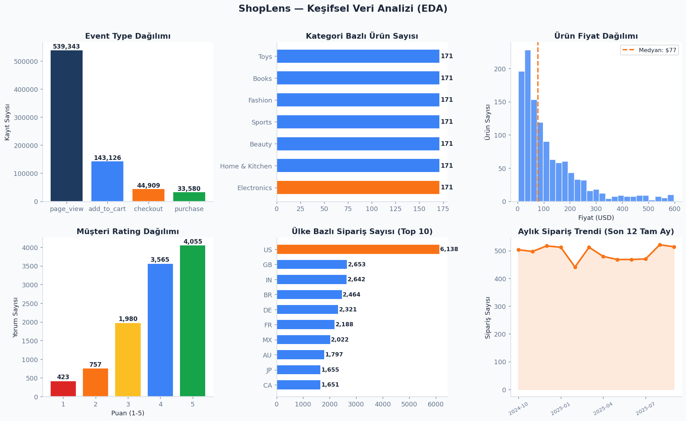 | Veri büyüklüğü, event dağılımı ve temel rating yapısının keşifsel özeti |
| 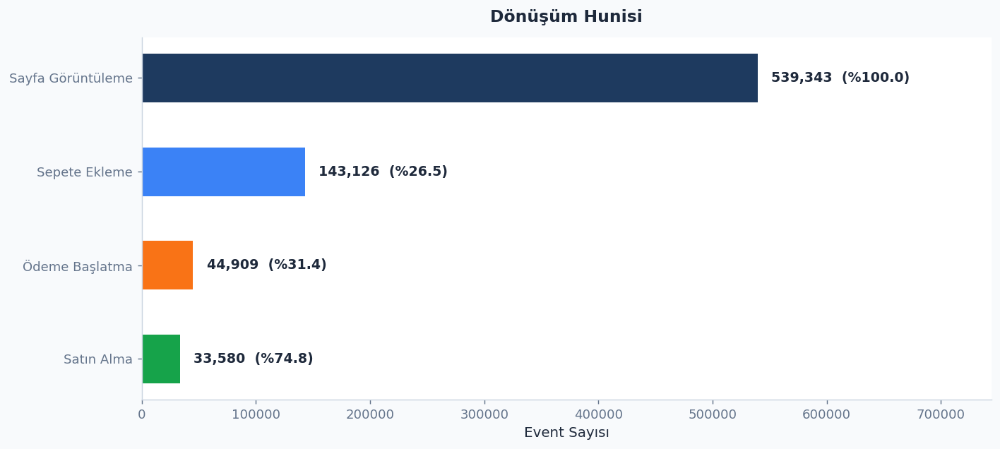 | Sayfa görüntüleme, sepete ekleme, checkout ve satın alma adımlarındaki dönüşüm hunisi |
| 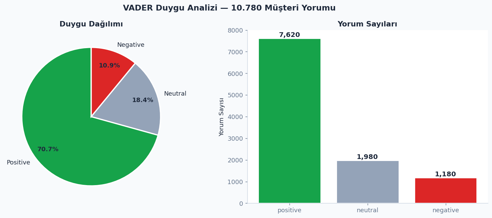 | VADER + rating hibrit yaklaşımıyla oluşan duygu dağılımı |
| 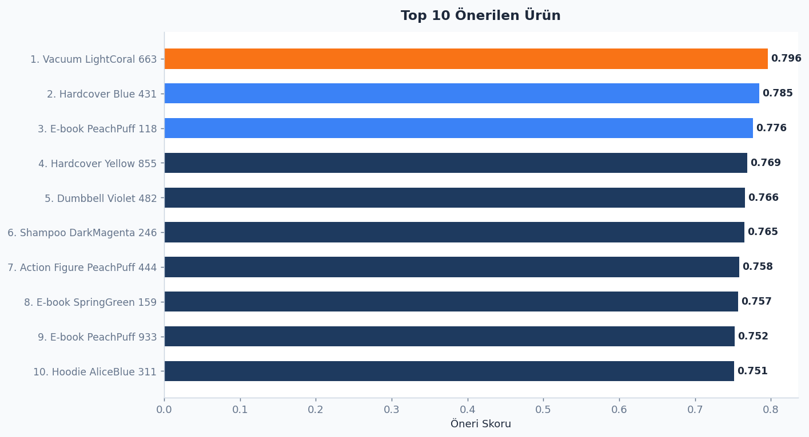 | Genel öneri listesinde öne çıkan ürünler |
| 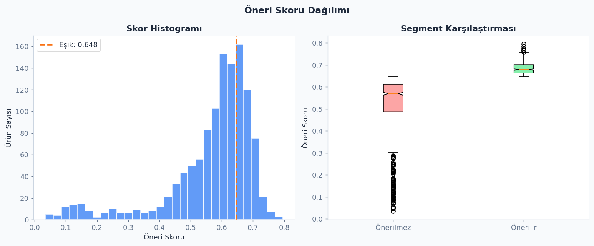 | Öneri skoru dağılımı ve önerilir ürün eşiği |
| 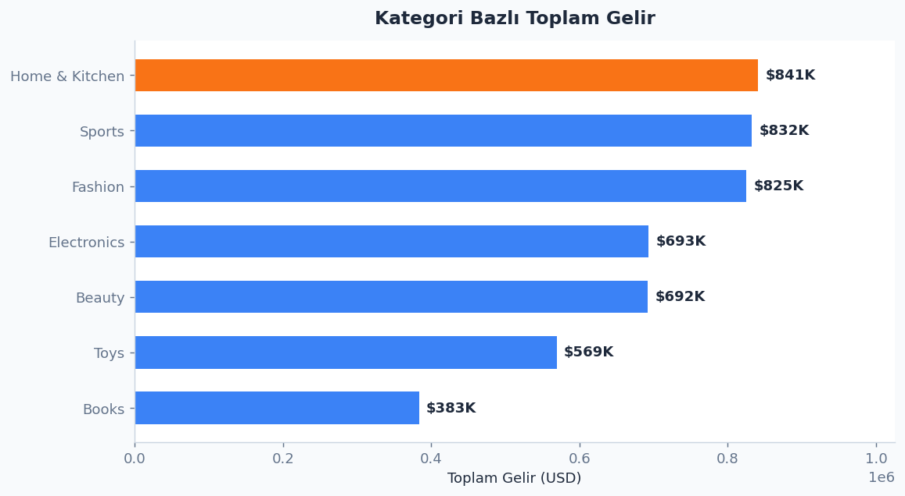 | Ürünlerin gelir katkısı ve ticari performans görünümü |
| 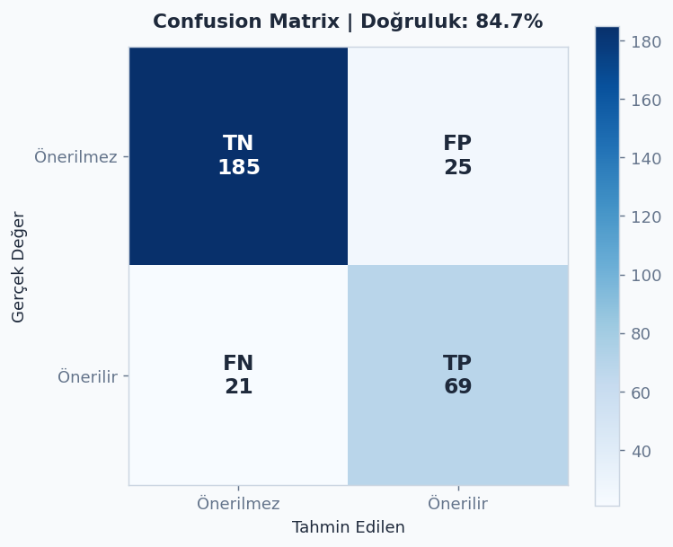 | Genel ürün öneri modelinin confusion matrix çıktısı |
| 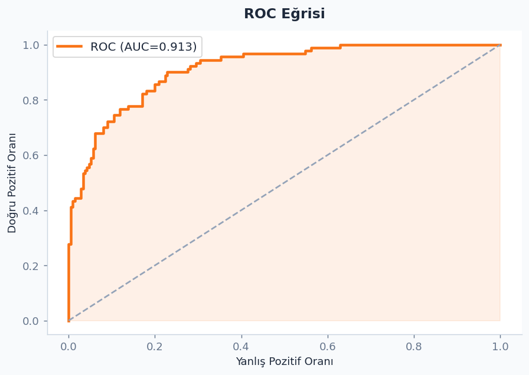 | Genel ürün öneri modelinin ROC eğrisi |
| 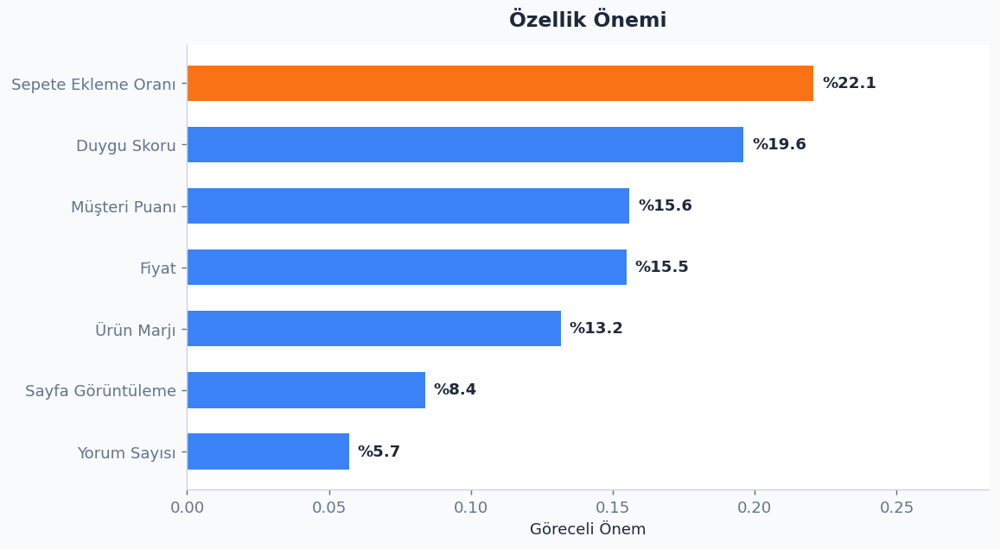 | Genel ürün modelinde kullanılan değişkenlerin göreceli önemleri |
| 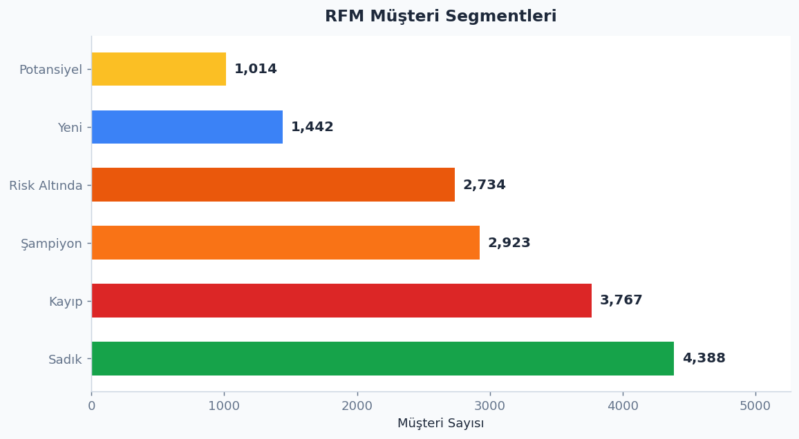 | RFM müşteri segmentlerinin dağılımı |
| 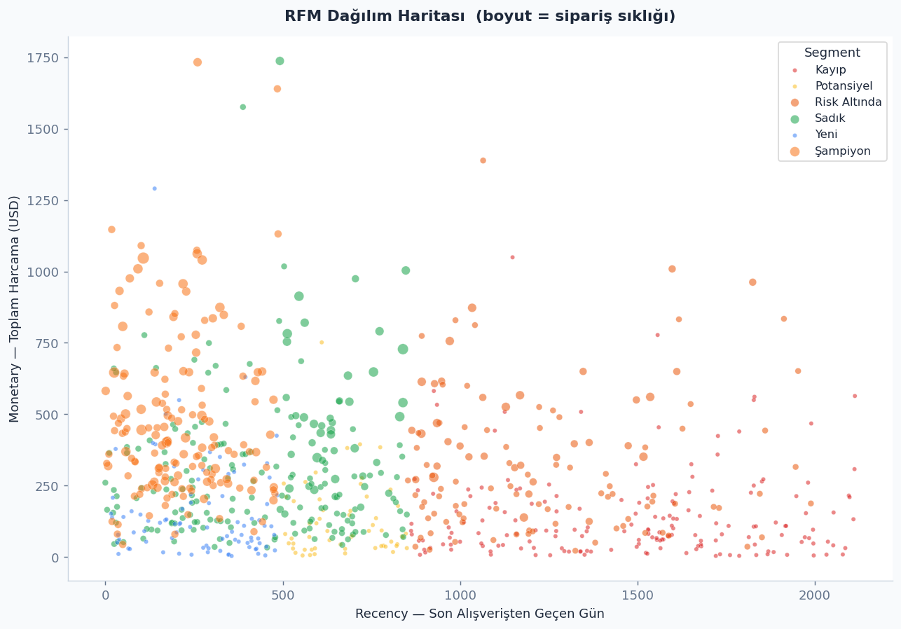 | RFM segmentlerinin recency ve harcama eksenindeki görünümü |
| 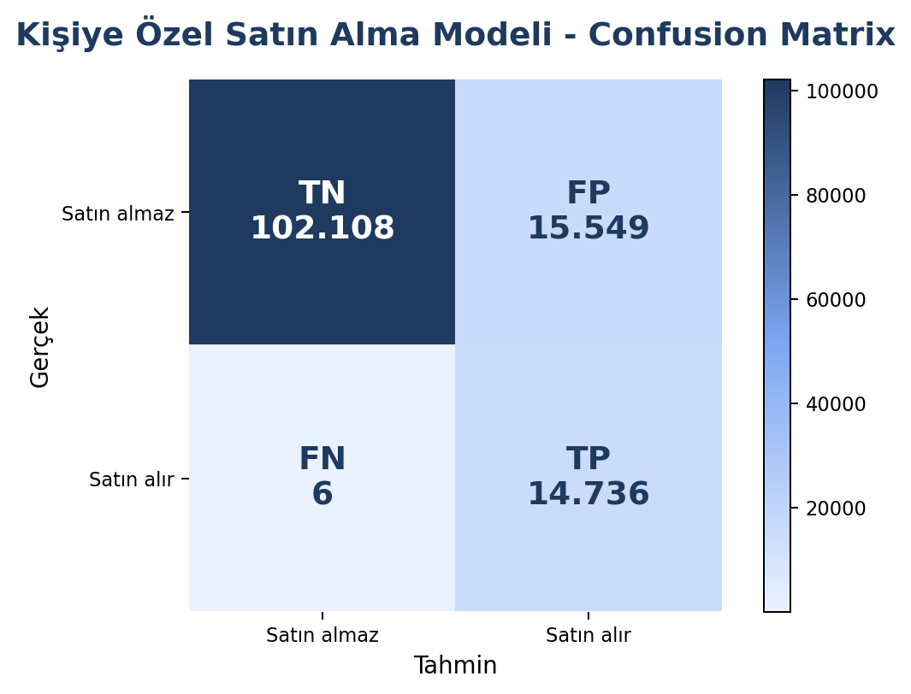 | Kişiye özel satın alma modelinin confusion matrix çıktısı |
| 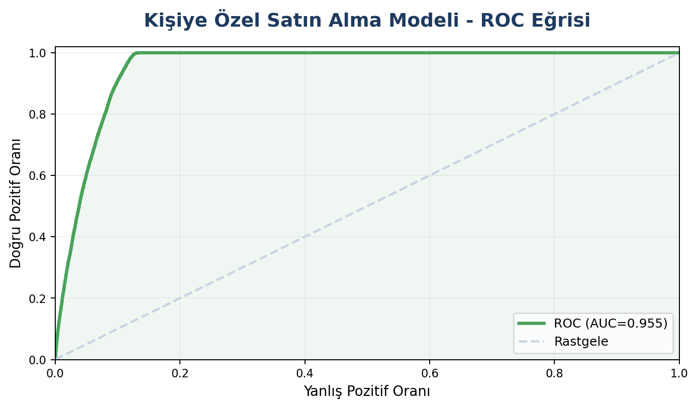 | Kişiye özel satın alma modelinin ROC eğrisi |
| 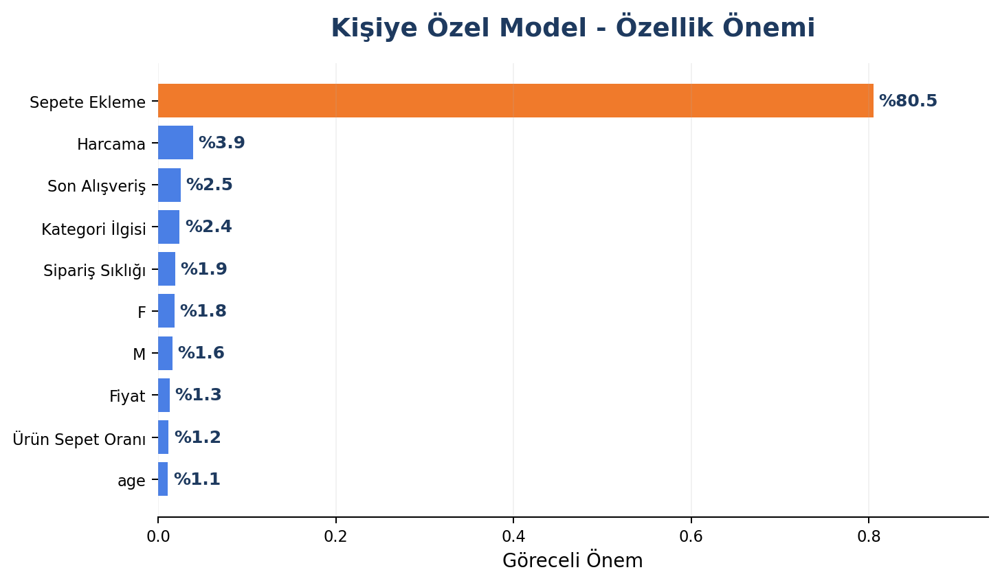 | Kişiye özel modelde kullanılan değişkenlerin göreceli önemleri |
| 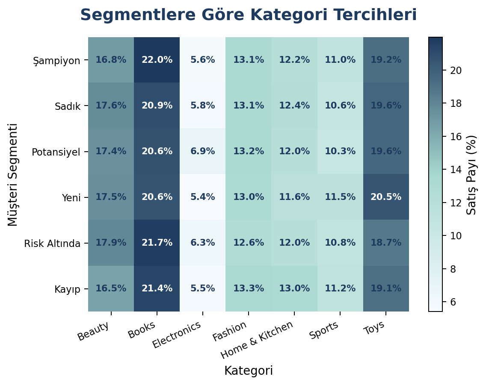 | RFM segmentlerinin kategori bazlı satış payları |

## Dashboard

Dashboard Streamlit ile hazırlandı. Ana bölümler:

- Genel özet ve dönüşüm hunisi
- Keşifsel veri analizi
- Genel ürün önerileri
- Model değerlendirmesi
- Duygu analizi
- Müşteri segmentasyonu, segment bazlı kategori tercihleri ve kişisel öneri
- İstatistiksel analizler

Canlı dashboard:

```text
https://shoplens.streamlit.app/
```

## Final Dosyaları

Teslim için ana dosyalar:

```text
README.md
requirements.txt
pipeline.py
dashboard.py
ShopLens_Sunum_Final.pptx
data/
outputs/
models/
```

## Canlı Dashboard Yayını

Dashboard Streamlit Community Cloud üzerinden yayınlanmıştır.

Yayın ayarları:

```text
Repository root: ShopLens
Main file path: dashboard.py
Python dependencies: requirements.txt
Streamlit config: .streamlit/config.toml
```

Canlı dashboard linki: https://shoplens.streamlit.app/
